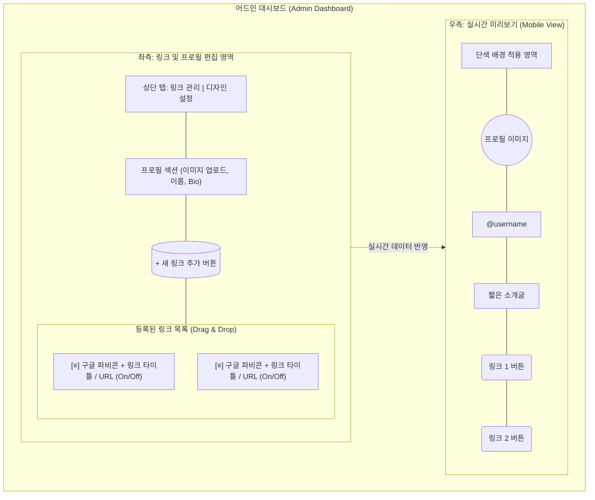
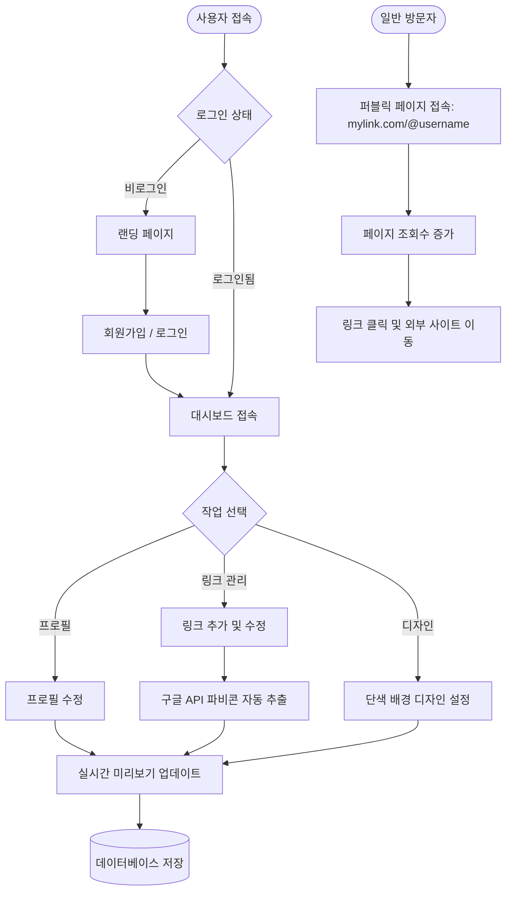

# MyLink 다이어그램: 와이어프레임 및 순서도

## 1. UI 와이어프레임 구조 (Wireframe)
관리자 대시보드(Admin Dashboard)와 사용자 퍼블릭 페이지(Public Page)의 대략적인 화면 구조를 나타냅니다.

## 2. 사용자 순서도 (User Flow)
사용자가 서비스에 접속하여 링크를 만들고, 일반 방문자가 그 링크를 클릭하기까지의 전체 흐름입니다.

